# Integración SAP Business One Service Layer con Python

Este repositorio contiene una serie de scripts en **Python** para extraer datos de **SAP Business One** a través del **Service Layer (OData)** y generar archivos **CSV** listos para ser consumidos por un POS, un *staging* en **MariaDB (AWS RDS)** u otros procesos analíticos.

# Arquitectura del Sistema

```mermaid
flowchart TB
    subgraph SAP["🏢 SAP BUSINESS ONE"]
        SL["Service Layer<br/>(OData REST API)<br/>:50000/b1s/v1"]
    end

    subgraph AUTH["🔐 AUTENTICACIÓN"]
        LOGIN["login()<br/>B1SESSION Cookie"]
    end

    subgraph HELPERS["⚙️ HELPERS & UTILIDADES"]
        REQ["req_get()<br/>Reintentos + Backoff"]
        STREAM["stream_entity()<br/>Paginación Masiva"]
        COUNT["service_count()<br/>Conteo Total"]
    end

    subgraph EXTRACTORS["📦 EXTRACTORES DE DATOS"]
        direction TB
        subgraph MASTERS["Maestros"]
            OITB["ItemGroups<br/>(OITB)"]
            OITM["Items<br/>(OITM)"]
            OSLP["SalesPersons<br/>(OSLP)"]
            OCRD["BusinessPartners<br/>(OCRD)"]
        end
        subgraph TRANS["Transacciones"]
            OINV["Invoices<br/>(OINV)"]
            INV1["DocumentLines<br/>(INV1)"]
        end
        subgraph INVENTORY["Inventario & Precios"]
            PRICES["ItemPrices<br/>(por PriceList)"]
            STOCK["Stock por Bodega<br/>& Totales"]
        end
    end

    subgraph OUTPUT["📁 SALIDA CSV"]
        CSV1["OITB.csv"]
        CSV2["OITM.csv"]
        CSV3["OSLP.csv"]
        CSV4["OCRD.csv"]
        CSV5["OINV.csv"]
        CSV6["INV1.csv"]
        CSV7["ITEMPRICE_PL#.csv"]
        CSV8["sl_stock_por_bodega.csv"]
        CSV9["sl_stock_totales.csv"]
    end

    subgraph DESTINO["🎯 DESTINO FINAL (Opcional)"]
        RDS[("MariaDB<br/>AWS RDS")]
        POS["Sistema POS"]
        BI["Reportes BI"]
    end

    SL <--> LOGIN
    LOGIN --> REQ
    REQ --> STREAM
    REQ --> COUNT
    
    STREAM --> OITB & OITM & OSLP & OCRD
    STREAM --> OINV & INV1
    STREAM --> PRICES & STOCK

    OITB --> CSV1
    OITM --> CSV2
    OSLP --> CSV3
    OCRD --> CSV4
    OINV --> CSV5
    INV1 --> CSV6
    PRICES --> CSV7
    STOCK --> CSV8 & CSV9

    CSV1 & CSV2 & CSV3 & CSV4 & CSV5 & CSV6 & CSV7 & CSV8 & CSV9 -.-> RDS
    RDS -.-> POS & BI
```


# Flujo de Ejecución Detallado

```mermaid
sequenceDiagram
    participant Script as 🐍 Python Script
    participant SL as 🏢 Service Layer
    participant FS as 📁 Sistema de Archivos
    participant RDS as 🗄️ MariaDB RDS

    Note over Script,SL: 1. Autenticación
    Script->>SL: POST /Login (user, pass, company)
    SL-->>Script: B1SESSION Cookie ✅

    Note over Script,SL: 2. Extracción de Maestros
    loop Para cada entidad (OITB, OITM, OSLP, OCRD)
        Script->>SL: GET /Entity?$select=...&$top=1000
        SL-->>Script: Página 1 + odata.nextLink
        Script->>SL: GET nextLink (página 2, 3, ...)
        SL-->>Script: Datos paginados
        Script->>FS: Escribir {Entity}.csv
    end

    Note over Script,SL: 3. Extracción de Facturas
    Script->>SL: GET /Invoices?$select=...
    SL-->>Script: Encabezados OINV
    Script->>FS: Escribir OINV.csv
    
    loop Para cada factura
        Script->>SL: GET /Invoices({DocEntry})/DocumentLines
        SL-->>Script: Líneas INV1
    end
    Script->>FS: Escribir INV1.csv

    Note over Script,SL: 4. Extracción de Precios (Multithreading)
    par Hilos paralelos (max_workers=16)
        Script->>SL: GET /Items('CODE1')/ItemPrices
        Script->>SL: GET /Items('CODE2')/ItemPrices
        Script->>SL: GET /Items('CODE3')/ItemPrices
    end
    Script->>FS: Escribir ITEMPRICE_PL#.csv

    Note over Script,SL: 5. Extracción de Stock
    Script->>SL: GET /Items?$filter=InventoryItem eq 'tYES'
    SL-->>Script: Items + ItemWarehouseInfoCollection
    Script->>FS: Escribir sl_stock_por_bodega.csv
    Script->>FS: Escribir sl_stock_totales.csv

    Note over FS,RDS: 6. Carga a RDS (Opcional)
    FS-->>RDS: LOAD DATA / INSERT (pymysql)
```


# Estructura de Entidades SAP B1

```mermaid
erDiagram
    OITB ||--o{ OITM : "contiene"
    OITM ||--o{ INV1 : "aparece en"
    OINV ||--|{ INV1 : "tiene líneas"
    OCRD ||--o{ OINV : "cliente"
    OSLP ||--o{ OINV : "vendedor"
    OITM ||--o{ ITEM_PRICES : "tiene precios"
    OITM ||--o{ ITEM_WAREHOUSE : "stock por bodega"

    OITB {
        int ItmsGrpCod PK
        string ItmsGrpNam
    }

    OITM {
        string ItemCode PK
        string ItemName
        int ItmsGrpCod FK
        date UpdateDate
        date CreateDate
    }

    OCRD {
        string CardCode PK
        string CardName
        string LicTradNum
        string E_Mail
        string Phone1
    }

    OSLP {
        int SlpCode PK
        string SlpName
    }

    OINV {
        int DocEntry PK
        int DocNum
        string CardCode FK
        int SlpCode FK
        date DocDate
        decimal DocTotal
    }

    INV1 {
        int DocEntry FK
        int LineNum
        string ItemCode FK
        string Dscription
        decimal Quantity
        decimal Price
        decimal LineTotal
    }

    ITEM_PRICES {
        string ItemCode FK
        int PriceList
        decimal Price
        string Currency
    }

    ITEM_WAREHOUSE {
        string ItemCode FK
        string Warehouse
        decimal InStock
    }
```


El foco principal es:

- Conectarse al Service Layer con sesión autenticada.
- Paginación robusta sobre entidades masivas (decenas o centenas de miles de registros).
- Exportar **maestros** y **transacciones** clave de SAP B1:
  - Maestros: `OITB`, `OITM`, `OSLP`, `OCRD`.
  - Transacciones: `OINV`, `INV1`.
  - Listas de precios por `PriceList`.
  - Stock por bodega y stock total por ítem.
- Generar CSV en la carpeta temporal del sistema (`tempfile.gettempdir()`).

---
## Entidades Soportadas

Este pipeline está diseñado para extraer y transformar las siguientes entidades clave de SAP Business One:

| Archivo Exportado (CSV) | Entidad SAP B1 (Objeto) | Descripción                                          |
| :---------------------- | :---------------------- | :--------------------------------------------------- |
| `OITM.csv`              | `Items`                 | Maestro de Artículos/Productos                       |
| `OCRD.csv`              | `BusinessPartners`      | Maestro de Socios de Negocio (Clientes/Proveedores)  |
| `OITB.csv`              | `ItemGroups`            | Grupos de Artículos                                  |
| `OSLP.csv`              | `SalesPersons`          | Vendedores / Empleados de Ventas                     |
| `OINV.csv`              | `Invoices`              | Encabezados de Facturas de Clientes                  |
| `INV1.csv`              | `DocumentLines`         | Líneas de Detalle de las Facturas                    |
| `ITEMPRICE_PL#.csv`     | `ItemPrices`            | Precios por Lista de Precios                         |
| `sl_stock_por_bodega.csv` | `ItemWarehouseInfo`     | Stock detallado por Almacén/Bodega                   |
| `sl_stock_totales.csv`  | `Items`                 | Stock total consolidado por Artículo                 |


---

## 1. Requisitos

### 1.1. Entorno

- **Python** >= 3.9
- Acceso a:
  - SAP Business One **Service Layer** (URL tipo `https://<host>:50000/b1s/v1`).
  - **Opcional**: base de datos **MariaDB** (por ejemplo, en AWS RDS) si luego se cargan los CSV.

### 1.2. Dependencias Python

Crea un archivo `requirements.txt` con:

```txt
requests
urllib3
pymysql          # opcional, sólo si vas a cargar CSV a MariaDB/RDS
python-dotenv    # opcional, si usas un archivo .env
```

#### Instalación

```bash
python -m venv .venv
# Linux/macOS
source .venv/bin/activate
# Windows
.venv\Scripts\activate
pip install -r requirements.txt
```

---

## 2. Configuración por variables de entorno

Todos los scripts leen parámetros desde **variables de entorno**, para no dejar credenciales ni URLs fijas en el código.

### 2.1. Conexión al Service Layer (obligatorio)

- `SAP_SL_BASE` — URL base del Service Layer.  
  *Ejemplo:* `https://mi-servidor-sap:50000/b1s/v1`
- `SAP_SL_COMPANY` — Nombre de la base de compañía (CompanyDB).
- `SAP_SL_USER` — Usuario de SAP B1 (por ejemplo, usuario técnico para Service Layer).
- `SAP_SL_PASS` — Contraseña del usuario anterior.
- `VERIFY_SSL` *(opcional)* — `true` / `false`. En los ejemplos se usa `false` para entornos de prueba (`verify=False` en `requests`), pero **en producción** se recomienda certificados válidos y `verify=True`.
- `PAGESIZE` *(opcional)* — Tamaño de página preferido para las llamadas OData (`odata.maxpagesize`). Por defecto, ~`1000`.

### 2.2. Parámetros para MariaDB en AWS RDS (opcional)

- `RDS_HOST` — hostname del RDS.  
- `RDS_DB` — nombre de la base.  
- `RDS_USER` — usuario de conexión.  
- `RDS_PASS` — contraseña.

> **Nota:** en el código de ejemplo se definen estas variables y se importa `pymysql`, pero la lógica de **carga a RDS** es externa a estos scripts y se puede implementar en otro módulo.

### 2.3. Parámetros de negocio (opcional)

- `WAREHOUSE_FILTER` — Código de bodega (por ejemplo `"11"`) para filtrar stock por bodega en el script de inventario. Si se deja vacío o no se define, se toman **todas** las bodegas.
- `PRICE_LIST_TARGET` — Número de lista de precios a exportar (por defecto `1`). Se usa en la exportación de precios por ítem.

Puedes administrar estas variables con un `.env` (y `python-dotenv`), o exportarlas manualmente:

```bash
# Ejemplo en Linux/macOS
export SAP_SL_BASE="https://mi-servidor-sap:50000/b1s/v1"
export SAP_SL_COMPANY="MI_COMPANIA_DB"
export SAP_SL_USER="USUARIO_SL"
export SAP_SL_PASS="********"
export VERIFY_SSL=true
export PAGESIZE=1000
export PRICE_LIST_TARGET=1
export WAREHOUSE_FILTER=""
```

O bien, ejemplo de `.env`:

```dotenv
SAP_SL_BASE=https://mi-servidor-sap:50000/b1s/v1
SAP_SL_COMPANY=MI_COMPANIA_DB
SAP_SL_USER=USUARIO_SL
SAP_SL_PASS=********
VERIFY_SSL=true
PAGESIZE=1000

# Opcionales
PRICE_LIST_TARGET=1
WAREHOUSE_FILTER=

# RDS opcional
RDS_HOST=your-db-host.rds.amazonaws.com
RDS_DB=pos
RDS_USER=dbuser
RDS_PASS=********
```


---
## 3. Arquitectura del Código y Helpers Clave

La lógica de extracción se basa en un conjunto de funciones auxiliares robustas diseñadas para la resiliencia y el rendimiento:

- **`login()`**: Establece una sesión autenticada contra el endpoint `/Login`, obteniendo y manteniendo la cookie `B1SESSION` para todas las operaciones subsecuentes.
- **`req_get()`**: Una capa de peticiones `GET` con **reintentos automáticos y backoff exponencial** para errores transitorios del Service Layer (HTTP `429`, `5xx`), garantizando la estabilidad de extracciones largas.
- **`stream_entity()`**: El motor de **paginación masiva**. Itera sobre todas las páginas de una entidad (ej. `Items`) siguiendo el `odata.nextLink` o gestionando el offset `$skip` manualmente, asegurando la obtención completa del dataset sin consumir memoria excesiva.
- **`sl_fetch_invoice_lines()`**: Implementa una estrategia de **fallback triple** para la extracción de líneas de factura, garantizando la compatibilidad con diferentes versiones y configuraciones del Service Layer.
- **`export_prices_csv()`**: Demuestra el uso de **multithreading** (`concurrent.futures`) para paralelizar las consultas y acelerar significativamente la recuperación de datos anidados como las listas de precios.

---

## 4. Exportación de maestros

### 4.1. ItemGroups (`OITB`)

**Función principal:**

```
export_all_itemgroups_csv(session, out_path=OITB_CSV)
```

**Salida:**

- Archivo: `OITB.csv`  
- Columnas:
  - `ItmsGrpCod` – código numérico del grupo (*Number* en SAP).
  - `ItmsGrpNam` – nombre del grupo (*GroupName* en SAP).

> Internamente usa `stream_entity(session, "ItemGroups", select="Number,GroupName", orderby="Number")`.

### 4.2. Items (`OITM`)

**Enfoque 1 — Exportación simple mapeando campos:**

- `sl_fetch` sobre `Items` con `select="ItemCode,ItemName,ItemsGroupCode,UpdateDate,CreateDate"`.
- Mapeo `ItemsGroupCode` → `ItmsGrpCod`.
- Genera `OITM.csv` con:
  - `ItemCode`, `ItemName`, `ItmsGrpCod`, `UpdateDate`, `CreateDate`.

**Enfoque 2 — Exportación masiva y robusta con `stream_entity` y conteo:**

```
export_all_items_csv(session, out_path=OITM_CSV)
```

- Usa `service_count(session, "Items")` para mostrar cuántos registros reporta `/Items/$count`.
- Pide páginas grandes (`PAGESIZE`), ordenadas por `ItemCode`.
- Escribe progresos cada N filas (2000, 4000, 6000, ...).
- Genera el **mismo layout** de columnas que el enfoque 1.

### 4.3. SalesPersons (`OSLP`)

```
export_all_salespersons_csv(session, out_path=OSLP_CSV)
```

**Salida:**

- Archivo: `OSLP.csv`  
- Columnas:
  - `SlpCode` – `SalesEmployeeCode` en SAP.
  - `SlpName` – `SalesEmployeeName` en SAP.

### 4.4. BusinessPartners (`OCRD`)

**Versión básica usando `sl_fetch`:**

- Consulta `BusinessPartners` con `select="CardCode,CardName,FederalTaxID,EmailAddress,Phone1,Cellular"`.
- Mapea:
  - `FederalTaxID` → `LicTradNum`
  - `EmailAddress` → `E_Mail`
- Añade campos vacíos para `Address` y `U_BirthDate` (opcionalmente se pueden llenar a futuro desde `BPAddresses` o UDFs).
- Genera `OCRD.csv` con columnas:  
  `CardCode, CardName, LicTradNum, E_Mail, Phone1, Cellular, Address, U_BirthDate, UpdateDate, CreateDate`.

**Versión masiva con `stream_entity`:**

```
export_all_bp_csv(session, out_path=OCRD_CSV)
```

- Usa `service_count(session, "BusinessPartners")` para log de conteo total.
- Recorre todas las páginas con `stream_entity(...)`.
- Escribe progreso cada 2000 registros.
- Genera el **mismo layout** de `OCRD.csv` descrito arriba.

---

## 5. Exportación de facturas (`OINV` / `INV1`)

La extracción de facturas se separa en **encabezados** y **líneas**:

### 5.1. Encabezados de factura — `OINV`

```
export_all_invoices_csv(session, out_path=OINV_CSV, where=None)
```

- **Parámetro `where`**: filtro OData opcional (por ejemplo `DocDate ge 2025-01-01` para limitar el rango de fechas).

**Salida:**

- Archivo: `OINV.csv`
- Columnas: `DocEntry`, `DocNum`, `CardCode`, `SlpCode` (desde `SalesPersonCode`), `DocDate`, `DocTotal`, `VatSum`.

> Además de escribir el CSV, la función **devuelve** la lista de diccionarios de facturas para ser reutilizada en la exportación de líneas.

### 5.2. Líneas de factura — `INV1`

La función clave para navegar líneas es:

```
sl_fetch_invoice_lines(session, base, doc_entry)
```

**Estrategia (robusta ante diferentes builds del Service Layer):**

1. `GET /Invoices({docEntry})/DocumentLines?$select=LineNum,ItemCode,ItemDescription,Quantity,UnitPrice,LineTotal`  
2. Si falla, `GET /Invoices({docEntry})/DocumentLines` (sin `$select`).  
3. Si aún no funciona, `GET /Invoices({docEntry})` y extrae la colección `DocumentLines` del objeto completo.

Luego, la exportación masiva usa:

```
export_all_invoice_lines_csv(session, invoices, out_path=INV1_CSV, progress_every=500)
```

- **Parámetros:** `invoices` es la lista devuelta por `export_all_invoices_csv`.
- **Salida:** Archivo `INV1.csv` con columnas:  
  `DocEntry`, `LineNum`, `ItemCode`, `Dscription` (desde `ItemDescription` o `Dscription`), `Quantity`, `Price` (UnitPrice o Price), `LineTotal`.
- La función informa cada cierto número de facturas procesadas (`progress_every`) y acumula el total de líneas exportadas.

---

## 6. Exportación de precios por lista de precios

El script de precios:

- Lista las `PriceLists` disponibles para mostrar en consola.
- Recorre todos los Items y, para cada `ItemCode`, busca el precio de la lista objetivo.

**Funciones relevantes:**

- `stream_items(s)` — Devuelve todos los `ItemCode` existentes (sin repetir), paginando con `$top/$skip` y/o `nextLink`.
- `fetch_item_price(s, code, pricelist_no)` — Obtiene el precio de un ítem en una lista específica.  
  **Estrategia:**
  - Intenta `GET /Items('ItemCode')` y revisa `ItemPrices`.
  - Si falla (por caracteres especiales en `ItemCode`, etc.), usa `GET /Items?$filter=ItemCode eq '...'`.

- `export_prices_csv(s, pricelist_no=PRICE_LIST_TARGET, out_path=PRICES_CSV, max_workers=16, progress_every=2000)` — Ejecuta las llamadas en **paralelo** usando `ThreadPoolExecutor` y va escribiendo progreso.

**Salida:**

- Archivo: `ITEMPRICE_PL{N}.csv`  
- Columnas: `ItemCode`, `PriceList` (número de la lista), `Price`, `Currency`.

---

## 7. Exportación de stock por bodega y total

Para inventario, se trabaja directamente sobre la entidad `Items` incluyendo la colección de bodegas:

- `ItemCode`, `ItemName`, `InventoryItem`, `QuantityOnStock`, `ItemWarehouseInfoCollection`

**Dentro del script se encuentran:**

- `get_page(endpoint, params=None)` — `GET` genérico para seguir `odata.nextLink` (normaliza URLs relativas/absolutas).
- `safe_float(x, default=0.0)` — Convierte textos o `None` a `float`, evitando excepciones.
- `main()` — Flujo completo:
  1. Login al Service Layer.
  2. Recorre todas las páginas de `Items` filtrando:
     - `InventoryItem eq 'tYES'`
     - `QuantityOnStock gt 0`
  3. Para cada ítem, recorre `ItemWarehouseInfoCollection` y escribe **stocks por bodega**.
  4. Agrupa los **totales por `ItemCode`**.

**Salidas:**

- Archivo: `sl_stock_por_bodega.csv` — Columnas: `ItemCode`, `Warehouse`, `InStock`  
- Archivo: `sl_stock_totales.csv` — Columnas: `ItemCode`, `InStockTotal`

> Si `WAREHOUSE_FILTER` está definido, sólo se escriben filas de la bodega indicada.

---

## 8. Rutas de salida y carpeta temporal

En casi todos los scripts se utiliza:

```python
import tempfile
TMPDIR = tempfile.gettempdir()
```

Los CSV se escriben en esa carpeta temporal, por ejemplo:

- **Windows:** `C:\Users\<usuario>\AppData\Local\Temp\OITM.csv`  
- **Linux:** `/tmp/OITM.csv`

Otros scripts usan nombres explícitos (`sl_stock_por_bodega.csv`, `sl_stock_totales.csv`) en el **directorio de ejecución**.

**Paths típicos definidos en el código:**

```python
OITM_CSV = os.path.join(TMPDIR, "OITM.csv")
OCRD_CSV = os.path.join(TMPDIR, "OCRD.csv")
OITB_CSV = os.path.join(TMPDIR, "OITB.csv")
OSLP_CSV = os.path.join(TMPDIR, "OSLP.csv")
OINV_CSV = os.path.join(TMPDIR, "OINV.csv")
INV1_CSV = os.path.join(TMPDIR, "INV1.csv")
PRICES_CSV = os.path.join(TMPDIR, "ITEMPRICE_PL1.csv")  # según lista objetivo
```

Ajusta estos nombres según la estructura de tu proyecto.

---

## 9. Ejemplos de ejecución

Los nombres de archivo `.py` dependerán de cómo organices tu repositorio. Un flujo típico podría verse así:

```bash
# 1) Exportar maestros (OITB, OITM, OSLP, OCRD)
python export_master_data.py

# 2) Exportar facturas y líneas (OINV / INV1)
python export_invoices.py

# 3) Exportar precios de la lista de precios objetivo
python export_prices.py

# 4) Exportar stock por bodega y totales
python export_stock_by_warehouse.py
```

Si trabajas desde un Jupyter Notebook o un script principal, basta con **importar** las funciones descritas (`login()`, `export_all_items_csv()`, etc.) y **llamarlas** en el orden que necesites.

---

## 10. Buenas prácticas y consideraciones

### Seguridad de credenciales

- Nunca subas al repositorio **credenciales reales** de SAP o RDS.
- Usa `.env` (añadido a `.gitignore`) o mecanismos seguros para inyectar variables de entorno.

### SSL

- En ejemplos se muestra `verify=False` para simplificar pruebas.  
- En producción, configura **certificados válidos** y activa la validación (`VERIFY_SSL=true` / `verify=True` en `requests`).

### Performance

- Ajusta `PAGESIZE` según la capacidad de tu Service Layer.
- Para entidades enormes (por ejemplo, facturas), considera aplicar **filtros de fecha** (`where=`) en lugar de traer todo de golpe si no es necesario.

### Resiliencia

- Los helpers de `req_get` aplican **reintentos** ante errores temporales (`429`, `5xx`), evitando que procesos masivos fallen por un pico momentáneo.

---

## 11. Próximos pasos (carga a POS / RDS)

Este set de scripts cubre la **extracción y generación de CSV** desde SAP Business One. El siguiente paso natural es implementar uno o más scripts que:

1. Lean estos CSV.  
2. Los carguen a una base de datos (por ejemplo, **MariaDB en AWS RDS**) usando `pymysql`, `LOAD DATA INFILE` u otro mecanismo de **bulk load**.  
3. Enlacen estas tablas con tu POS o sistema de reportes.

Esa lógica de carga puede vivir en un módulo separado (por ejemplo, `load_to_rds.py`) y reutilizar las **mismas variables de entorno** definidas en este proyecto.

---

Con esta estructura, el repositorio documenta de forma clara **cómo se integran SAP Business One y Python usando el Service Layer**, y ofrece un **pipeline reproducible** para extraer **maestros**, **transacciones**, **precios** e **inventarios** en volúmenes grandes.

---
## Sobre el Autor

Desarrollado por **Jean Paul Panchana Espinoza**, Arquitecto de Soluciones Cloud y especialista en integración de sistemas. Conectemos en [LinkedIn](https://www.linkedin.com/in/jeanpaulpaes/).

---
## 12. Licencia

Este proyecto se distribuye bajo la licencia MIT. Ver el archivo `LICENSE` para más detalles.
